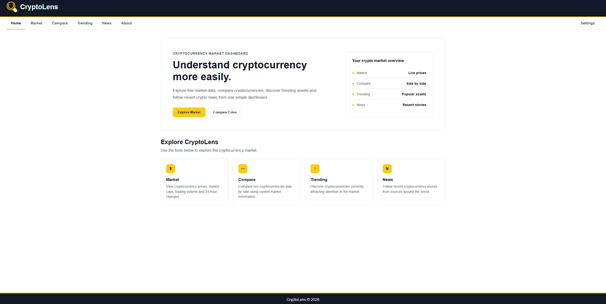
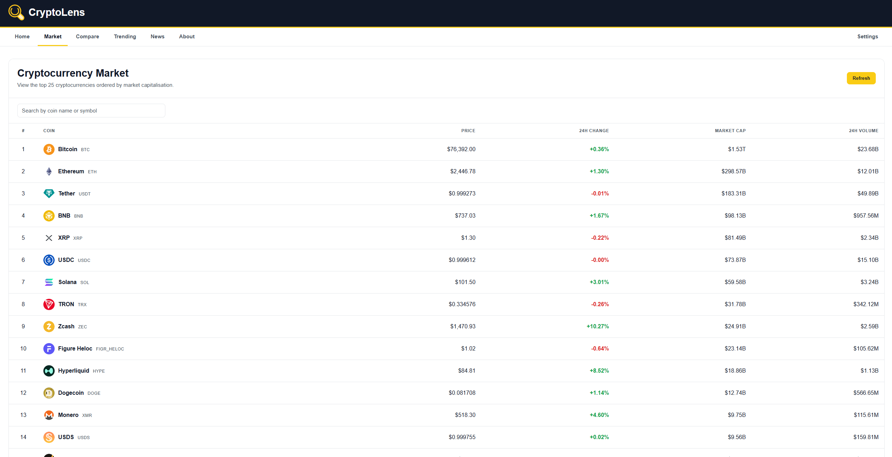
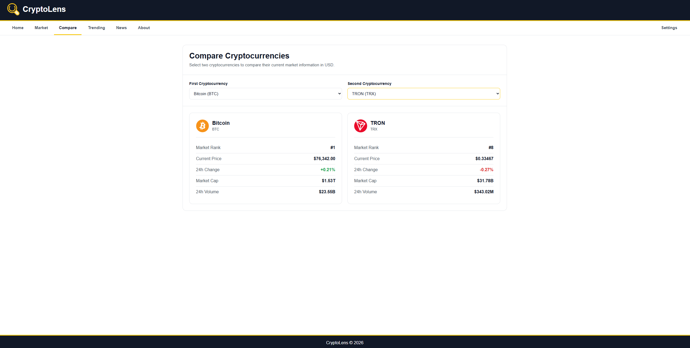
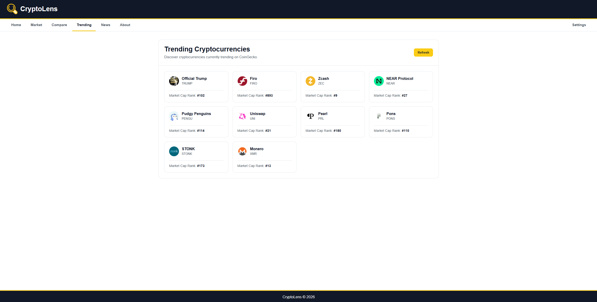
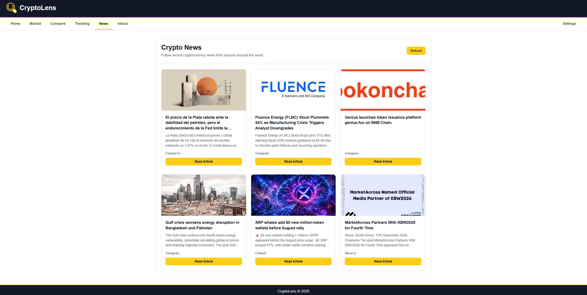
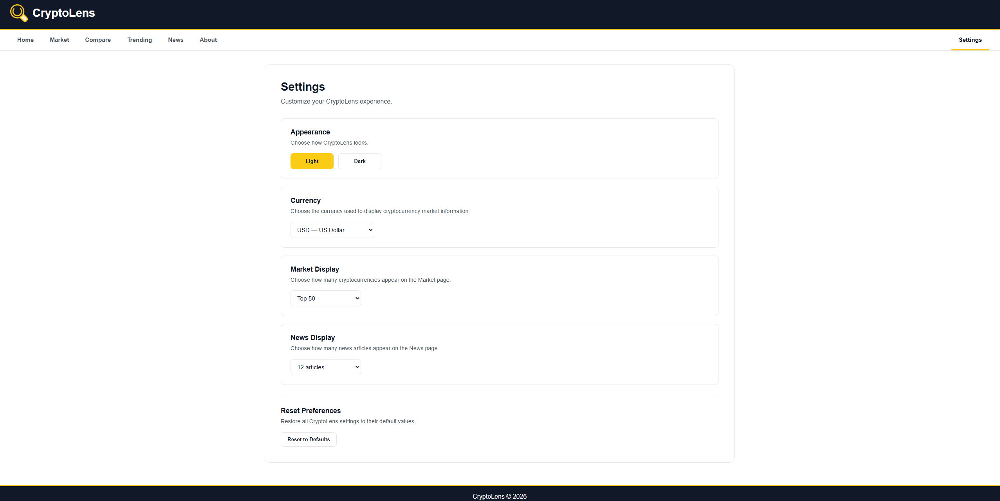

# CryptoLens

CryptoLens is a responsive cryptocurrency dashboard for exploring market data, comparing digital assets, discovering trending cryptocurrencies, and following recent crypto news from one place.

The application uses live cryptocurrency data from CoinGecko and crypto news from NewsData.io.



## Features

### Cryptocurrency Market

Browse current cryptocurrency market information including:

- Current price
- Market capitalization
- 24-hour trading volume
- 24-hour price change
- Cryptocurrency ranking
- Search by cryptocurrency name or symbol

Users can choose to display the Top 10, Top 25, or Top 50 cryptocurrencies.



### Cryptocurrency Comparison

Compare two cryptocurrencies side by side using current market information.

The comparison includes:

- Market rank
- Current price
- 24-hour price change
- Market capitalization
- 24-hour trading volume



### Trending Cryptocurrencies

Discover cryptocurrencies that are currently attracting attention using CoinGecko's trending cryptocurrency data.



### Cryptocurrency News

Follow recent cryptocurrency stories from sources around the world.

News cards display article titles, descriptions, publication information, and links to the original articles.

Users can choose to display 6, 9, or 12 news articles.



### User Preferences

CryptoLens includes a dedicated Settings page where users can customize their experience.

Available preferences include:

- Light and dark themes
- USD, AUD, EUR, and GBP currencies
- Top 10, Top 25, or Top 50 market display
- 6, 9, or 12 news articles
- Reset preferences option

Preferences are stored locally in the browser using `localStorage`.



## Technologies

- HTML
- CSS
- JavaScript
- Lit
- Web Components
- CoinGecko API
- NewsData.io API
- Browser Local Storage

## APIs

### CoinGecko

CryptoLens uses the CoinGecko API to retrieve cryptocurrency market information and trending cryptocurrency data.

https://www.coingecko.com/en/api

### NewsData.io

CryptoLens uses the NewsData.io Crypto News API to retrieve recent cryptocurrency news.

https://newsdata.io/

## Project Structure

```text
CryptoLens-Dashboard/
├── img/
│   ├── CryptoLens_Icon.png
│   ├── home-screenshot.png
│   ├── market-screenshot.png
│   ├── compare-screenshot.png
│   ├── trending-screenshot.png
│   ├── news-screenshot.png
│   └── settings-screenshot.png
│
├── src/
│   ├── components/
│   │   ├── about-page.js
│   │   ├── compare-page.js
│   │   ├── market-page.js
│   │   ├── news-page.js
│   │   ├── settings-page.js
│   │   ├── toggle-theme.js
│   │   └── trending-page.js
│   │
│   ├── api-key.js
│   ├── config.js
│   └── cryptoLens-dashboard.js
│
├── .gitignore
├── index.html
├── package.json
└── README.md
```

## Running CryptoLens Locally

Clone the repository:

```bash
git clone https://github.com/fahmida-alam/CryptoLens-Dashboard.git
```

Move into the project directory:

```bash
cd CryptoLens-Dashboard
```

Because CryptoLens uses JavaScript modules, run the project through a local web server rather than opening `index.html` directly.

For example, you can use the Live Server extension in Visual Studio Code.

## NewsData API Key Setup

CryptoLens requires a NewsData.io API key to load cryptocurrency news.

The API key is intentionally excluded from the GitHub repository.

Create the following file:

```text
src/api-key.js
```

Add your NewsData API key:

```javascript
export const NEWSDATA_API_KEY =
  "YOUR_NEWSDATA_API_KEY";
```

The `api-key.js` file is included in `.gitignore`, preventing the API key from being committed to the repository.

## Developer

Designed and developed by **Fahmida Alam**.

- GitHub: https://github.com/fahmida-alam
- LinkedIn: https://www.linkedin.com/in/fahmida-alam-409089264

## Disclaimer

Cryptocurrency information displayed on CryptoLens is provided for informational purposes only and should not be considered financial advice.